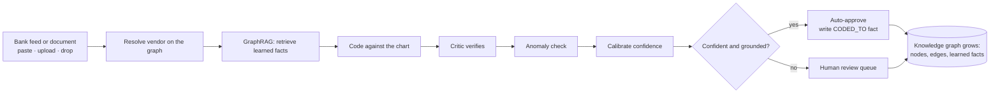
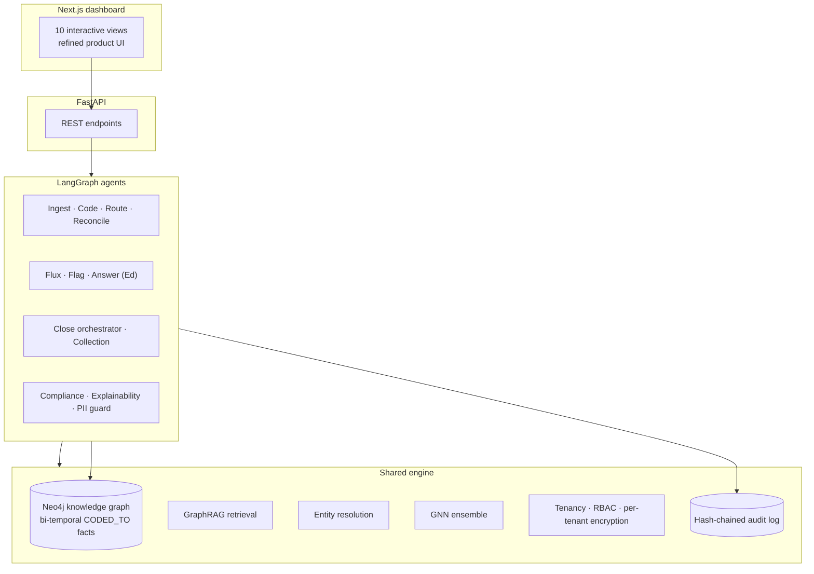
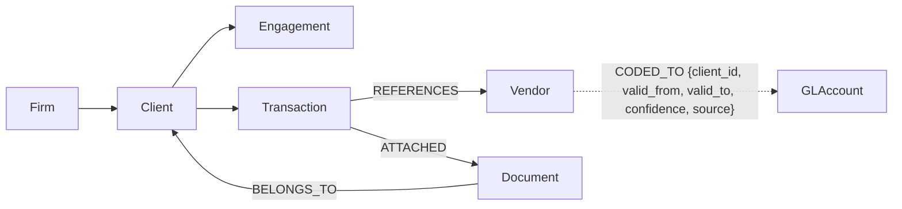
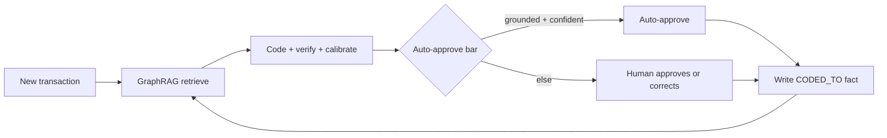
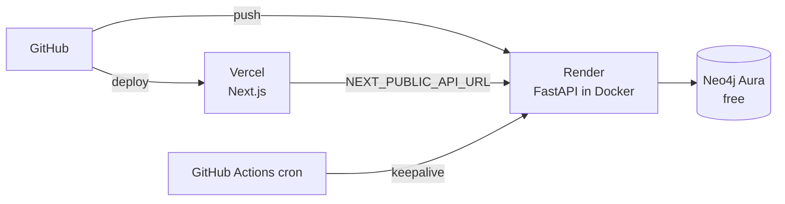

<div align="center">

# Trustmax

### A graph-native, audit-grade trust layer for accounting AI

Route every document to the right client, flag anomalies, code transactions on a learning flywheel,
reconcile the bank, narrate the variance, and answer client questions from their own ledger with a hard
no-hallucination guarantee. Every decision is grounded in a knowledge graph, cited, and written to a
tamper-evident audit log.

[](https://web-six-phi-22.vercel.app)
[](https://trustmax-api.onrender.com/health)


**Live app:** https://web-six-phi-22.vercel.app  ·  **API:** https://trustmax-api.onrender.com  ·  Hosted end to end at zero cost

</div>

---

## Table of contents

- [The idea](#the-idea)
- [What makes it different](#what-makes-it-different)
- [The product surface](#the-product-surface)
- [Live ingest: the graph updates itself](#live-ingest-the-graph-updates-itself)
- [Architecture](#architecture)
- [The knowledge graph](#the-knowledge-graph)
- [The learning flywheel](#the-learning-flywheel)
- [Grounded Q&A: the anti-hallucination design](#grounded-qa-the-anti-hallucination-design)
- [Trust and security](#trust-and-security)
- [Evaluation](#evaluation)
- [Tech stack](#tech-stack)
- [Quickstart](#quickstart)
- [Deploy at zero cost](#deploy-at-zero-cost)
- [The dashboard](#the-dashboard)
- [Project structure](#project-structure)

---

## The idea

Accounting AI fails in exactly the places a CPA firm cannot tolerate: a document routed to the wrong
client, a number hallucinated in a client answer, a coding decision nobody can explain to a reviewer or
the IRS. Trustmax treats those failures as the product. It puts a **temporal knowledge graph** at the
center, so every decision is grounded in a real fact, carries a reasoning path, is human-approval-gated,
and is written to a hash-chained audit log.

It is built around two personas, mirroring how a modern firm runs:

- **Max**, the back office: ingest, route, extract, code, reconcile, flag, narrate the variance, and run
  the month close.
- **Ed**, the client side: answer questions from the client's own ledger, and proactively chase the
  documents a close is waiting on.

And one rule across all of it: **you approve everything.**

---

## What makes it different

| Most accounting AI | Trustmax |
| --- | --- |
| Vector store of past examples | A **knowledge graph** of vendors, clients, accounts, and learned facts |
| Numbers generated by the model | Numbers **computed by query**, the model only phrases the sentence |
| "Trust me" answers | Every answer **cited and validated**, abstains when it cannot ground |
| Opaque categorization | Every code carries a **reasoning path** you can inspect |
| Static accuracy | A **flywheel**: each approval writes a fact, accuracy and safe autonomy climb |
| Logs you have to trust | A **hash-chained audit log** that proves nothing was quietly altered |

---

## The product surface

Ten interactive views, one shared engine.

### Max, the back office

| Capability | What it does |
| --- | --- |
| **Live Ingest** | Paste, upload, or drop a bank feed or a document. Max resolves the vendors on the graph, codes each line, flags anomalies, and writes the new nodes, edges, and learned facts into the graph live. |
| **Coding and Flywheel** | Categorize transactions to the GL, graph-first. Each approval writes a `CODED_TO` fact, so accuracy and safe autonomy rise over time while the auto-approved error rate stays near zero. |
| **Document Routing** | Entity-link each incoming document to the right client and engagement. It only auto-routes at near-certain confidence, because a misroute is a breach. |
| **Reconciliation** | Match the bank statement to the ledger on amount, date, and payee, then surface only the exceptions (on-statement-only, amount mismatch, outstanding, timing) with reasons and suggested fixes. |
| **Flux and Variance** | Month-over-month variance computed from the ledger, narrated in plain English, every swing traced to the driving transactions. |
| **Close and Collect** | One orchestrated workflow: collect missing documents, route what came in, extract fields, code, flag, and draft the client update, with approval at every gate. Plus a CSV / QuickBooks import seam. |
| **Anomaly Flags** | Duplicates, unusual amounts, and missing categories, each with the evidence that justifies it. |

### Ed, the client side

| Capability | What it does |
| --- | --- |
| **Ask Ed** | A grounded chat over the client's own ledger. Numbers are computed by query and validated, the model only phrases the reply, and Ed abstains and escalates when it cannot ground an answer. Conversational, with memory, and it clears on a client change. |
| **Proactive collection** | A PBC checklist that detects missing documents and drafts an approval-gated reminder to chase them. |

### Trust

| Capability | What it does |
| --- | --- |
| **Trust and Security** | A compliance agent that scans for governance risk, an explainability agent that narrates any number, interactive threat-and-solution demos (tamper, cross-tenant, RBAC, encryption, PII), and an "explain this number" picker that traces any transaction to its full decision path. |

---

## Live ingest: the graph updates itself

Drop fresh input in and the whole pipeline runs autonomously, with the knowledge graph growing in real
time. This is the flywheel turning on live data, not a batch job.



The Live Ingest view shows a before-and-after snapshot of the graph (nodes, edges, learned facts), the
pipeline timeline, and every line coded on the way in, with its grounding and reasoning path.

---

## Architecture



Model-agnostic LLM adapter (open-weight Llama via Groq, with a deterministic offline mock), a Neo4j
primary graph with an embedded NetworkX fallback, and a SQLite relational store with a Postgres path.
Swapping any one of them changes no business logic.

---

## The knowledge graph

The defining structure is a bi-temporal, provenance-bearing fact: **why is this vendor coded to this
account for this client, since when, and how sure are we.** New approvals invalidate the prior fact
(set `valid_to`) instead of deleting it, giving an audit-grade history.



Retrieval is **GraphRAG**: a client-scoped subgraph lookup that returns the candidate code, the basis,
and a reasoning path, ranked client-history first, then firm convention, then generic prior. The same
graph powers lineage ("explain this number"), reconciliation matching, and the routing signals.

---

## The learning flywheel

The base model does not know a firm's idiosyncratic conventions (one firm codes Apex to COGS, another to
Office Supplies). Every human approval writes a `CODED_TO` fact into the graph. The next time that vendor
appears for that client, retrieval finds the fact and the decision is grounded and confident.



Ungrounded items face a higher bar to auto-approve: trust is earned. Once the graph holds a fact, the
normal threshold applies. Accuracy and the safe auto-approve rate climb across batches while the
auto-approved error rate stays near zero.

---

## Grounded Q&A: the anti-hallucination design

Ed never lets the model invent a number.

1. **Scope guard** locks retrieval to that one client's subgraph, which also prevents cross-client leakage.
2. **Constrained planning**: the model emits a query plan over a whitelist of typed tools (`sum_by_category`, `top_vendors`, `total_expense`, `count`, and more). It does not compute.
3. **Compute by code**: the system runs the query deterministically over the ledger.
4. **Validation**: every number in the drafted sentence is checked against the computed value. A mismatch is refused.
5. **Citations**: each answer cites the exact transactions behind it.
6. **Abstain and escalate**: if it cannot ground the answer, or it needs professional judgement, Ed says so and loops in the accountant instead of guessing.

The model only phrases the sentence around a number that was already computed and validated.

---

## Trust and security

- **Tamper-evident audit**: every action is hash-chained. Edit one posted row and the chain breaks at that row, provably.
- **Multi-tenancy**: every node, edge, and row is scoped by `firm_id`. One firm cannot read another's data.
- **RBAC**: least privilege per role. An associate can approve and correct but cannot export the audit log or message clients.
- **Per-tenant encryption**: PII is encrypted with a key derived from the firm. One firm's key cannot decrypt another's data.
- **Compliance agent**: a background reviewer that flags high-value auto-approvals, self-approval, approval concentration, unresolved high-severity alerts, and vendors with a high correction rate.
- **Explainability agent**: narrates any number in plain English, strictly from its lineage, with the amount and code validated against the graph.
- **PII guard**: every client-facing message is scanned, and SSNs and account numbers are blocked and redacted before anything can be sent.

The Trust view turns each of these into an interactive threat-and-solution demo you can run live.

---

## Evaluation

Every number is reproducible from the synthetic, fully-labeled corpus.

| Suite | What it proves | Result |
| --- | --- | --- |
| Coding flywheel | Accuracy and safe autonomy rise across batches | accuracy climbs to ~100%, auto-approved error near 0 |
| Entity resolution | Vendor and alias dedup | ~99% accuracy on labeled aliases |
| Routing | Misroute rate at the auto-route threshold | ~0% misroute |
| Anomaly | Precision and recall on injected anomalies | duplicates, amount outliers, missing categories caught |
| Grounded Q&A | Groundedness, numeric accuracy, correct abstention | numbers computed and validated, abstains when ungrounded |
| Reconciliation | Auto-match rate, exceptions surfaced | ~89% auto-matched, exceptions categorized with fixes |

---

## Tech stack

| Layer | Choice |
| --- | --- |
| Knowledge graph | Neo4j (primary), NetworkX (embedded fallback) |
| Agents | LangGraph multi-step pipelines |
| LLM | Open-weight Llama via Groq, deterministic offline mock |
| Retrieval | GraphRAG over the client subgraph |
| ML | GNN ensemble (PyTorch Geometric) with a scikit-learn fallback, calibrated confidence |
| Entity resolution | normalize, exact, fuzzy, embeddings |
| Relational store | SQLite (Postgres path) |
| Backend | FastAPI |
| Frontend | Next.js, TypeScript, Tailwind, Recharts |
| Security | per-tenant encryption (Fernet), RBAC, hash-chained audit |
| Deploy | Vercel, Render, Neo4j Aura, GitHub Actions keepalive, all free tier |

---

## Quickstart

```bash
# 0. setup
python -m venv .venv && source .venv/bin/activate
pip install -r requirements.txt
cd web && npm install && cd ..

# 1. graph (Docker) — optional, falls back to embedded NetworkX
docker compose up -d neo4j

# 2. data + graph   (--scale test | cloud | demo | showcase | big)
python -m app.datagen.generate --scale demo
python -m app.kg.build

# 3. prove it
python -m app.evals.code_eval firm00     # the flywheel
python -m app.evals.security_eval         # tenancy, RBAC, encryption, audit

# 4. run the product
uvicorn app.api:app --port 8000           # backend
cd web && npm run dev                     # http://localhost:3000
```

Set `GROQ_API_KEY` in `.env` for live phrasing, or leave it unset to run fully offline on the mock
provider. Switches: `LLM_PROVIDER=groq|mock`, `GRAPH_BACKEND=neo4j|networkx`, `DATA_SCALE=...`.

---

## Deploy at zero cost

The whole stack runs on free tiers.



The Docker build seeds a self-contained demo (`app/deploy_seed.py`): generate the corpus, build the
graph, run the flywheel, and persist it, so the dashboard is fully populated on first load. Secrets live
only in `.env` and the host's environment variables, never in the repo.

---

## The dashboard

A refined, product-grade interface: a grouped icon sidebar, a knowledge-graph panel, tabular ledger
numerals, drill-downs everywhere, and orchestrated motion.

| View | Highlight |
| --- | --- |
| Overview | Firm stats and a live knowledge-graph panel (nodes, edges, learned facts) |
| Live Ingest | Drop input, watch the graph grow, see every line coded on the way in |
| Coding and Flywheel | Accuracy-over-time chart, per-batch table, reasoning-path drill-down |
| Document Routing | Routing verdicts with graph signals and field extraction on expand |
| Reconciliation | Match rate, value reconciled, and a filtered exceptions queue |
| Flux and Variance | A computed flux note, a variance table, and drill-to-source drivers |
| Close and Collect | The close orchestrator timeline plus a CSV import seam |
| Anomaly Flags | Filterable alerts with evidence and confirm-or-dismiss |
| Ask Ed | A grounded chat with citations, agent trace, and graceful abstention |
| Trust and Security | Threat simulations, the compliance agent, and an explain-any-number picker |

---

## Project structure

```
trustmax/
  app/
    agents/        ingest, code, router, recon, flux, anomaly, answer (Ed),
                   collection, orchestrator, importer, compliance, explain, extract
    kg/            store (Neo4j + NetworkX), build, retrieval, lineage, entity_resolution
    security/      tenancy, rbac, crypto, pii
    trust/         hash-chained audit
    datagen/       seeds + generator (labeled synthetic corpus, scale tiers)
    evals/         code, routing, anomaly, qa, security
    providers/     Groq + offline mock (one interface)
    api.py         FastAPI surface the dashboard consumes
    deploy_seed.py single-process cloud seed
  web/             Next.js dashboard (App Router, Tailwind, Recharts)
  Dockerfile · render.yaml · docker-compose.yml · .github/workflows/keepalive.yml
```

<div align="center">

Built to make accounting AI something a firm can actually trust.

</div>
