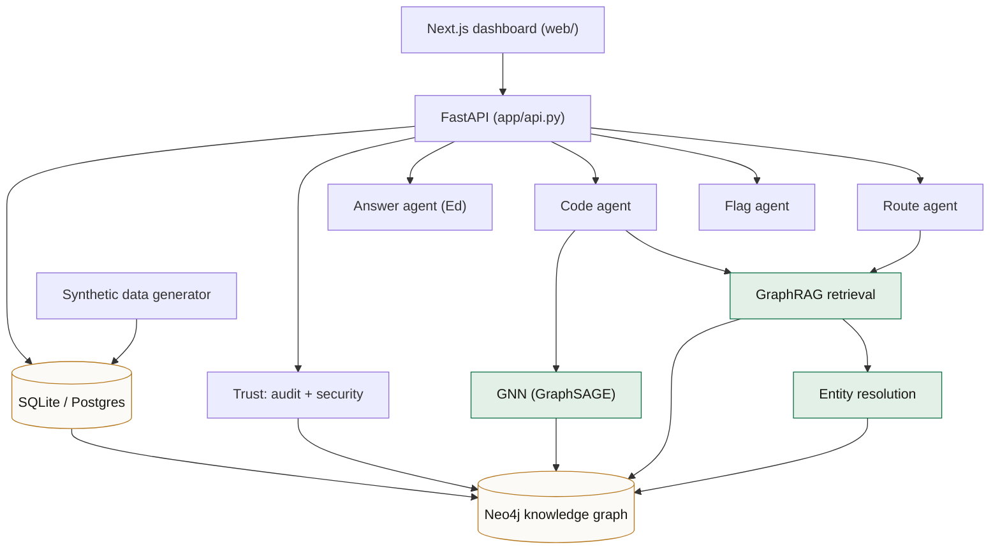
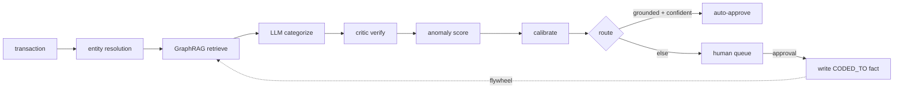
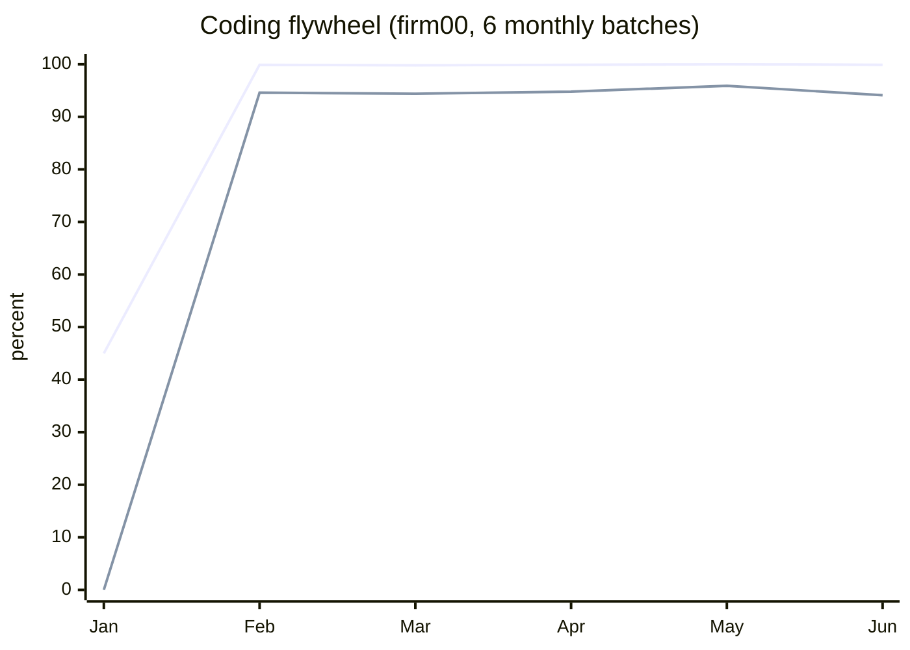
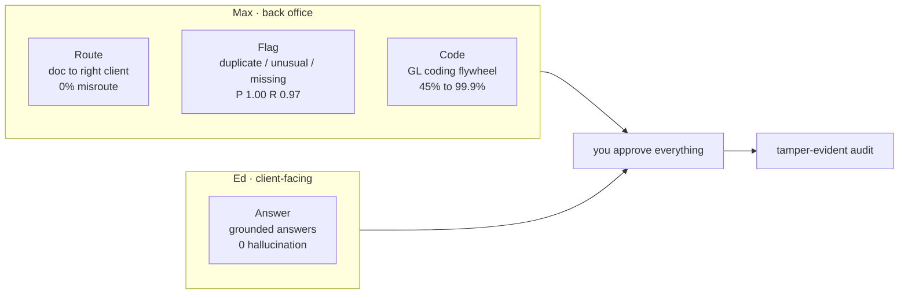
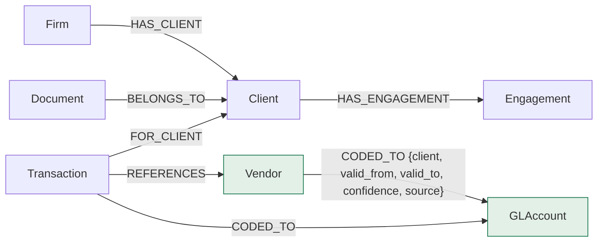

<div align="center">

# Trustmax

### A graph-native, audit-grade trust layer for accounting AI

*Route documents. Flag anomalies. Code transactions. Answer client questions.*
*Every decision learned, cited, approval-gated, and auditable.*


</div>

---

## Table of contents

- [The idea](#the-idea)
- [What it does](#what-it-does-validated)
- [Architecture](#architecture)
- [The flywheel](#the-flywheel)
- [The four capabilities](#the-four-capabilities)
  - [Code: the GL coding flywheel](#1-code-the-gl-coding-flywheel)
  - [Route: document routing](#2-route-document-routing)
  - [Flag: anomaly detection](#3-flag-anomaly-detection)
  - [Answer: grounded client Q&A](#4-answer-grounded-client-qa-the-anti-hallucination-design)
- [Knowledge graph](#knowledge-graph)
- [Entity resolution](#entity-resolution)
- [Graph neural network](#graph-neural-network)
- [Security and trust model](#security-and-trust-model)
- [Evaluation](#evaluation-every-number-reproducible)
- [Tech stack](#tech-stack)
- [Design decisions and the open-source survey](#design-decisions-and-the-open-source-survey)
- [Quickstart](#quickstart)
- [The dashboard](#the-dashboard)
- [Runbook and switches](#runbook-and-switches)
- [Project structure](#project-structure)

---

## The idea

> **The human-approval step an accounting platform already requires is not overhead. It is a data flywheel.**

Each time a CPA approves or corrects an AI decision, Trustmax writes a **bi-temporal, provenance-bearing
fact** into a knowledge graph:

```
(Vendor)-[:CODED_TO {client_id, valid_from, valid_to, confidence, source}]->(GLAccount)
```

GraphRAG retrieves those facts, so every GL code comes with a white-box reasoning path. The system
**earns autonomy**: it reviews everything at cold start, then safely automates the vast majority once
the graph has learned. A correction invalidates the prior fact instead of deleting it, so the history
stays auditable, and everything lands on a tamper-evident audit trail.

Built to mirror, and plug into, a platform like Maxed: *Max handles the back office, Ed handles
clients, you approve everything, and every action is logged and traceable.*

---

## What it does (validated)

Generated corpus at **showcase scale**: 20 firms, 500 clients, **275,986 transactions**, 20,000
documents, 780 vendors, 2,400 vendor aliases. Knowledge graph: **298,246 nodes, 551,975 edges**, built
in ~55 seconds.

| Capability | Headline metric | Result |
|---|---|---|
| **Code** transactions (the flywheel) | accuracy / safe autonomy rise as the graph learns | **45% to 99.9%** accuracy, **0% to 94%** auto-approve, **~0.1%** error |
| **Route** documents to the right client | never auto-sends to the wrong client | **59% auto-routed, 0% misroute** |
| **Flag** anomalies | no false positives, full evidence | precision **1.00**, recall **0.97** |
| **Answer** client questions (Ed) | zero hallucination | numeric **1.00** / grounded **1.00** / abstention **1.00** / fabrication **0.00** |
| **Resolve** vendor aliases | consistent vendors across aliases | **99.4%** accuracy |
| **GNN** GL coding (PyG GraphSAGE) | graph structure predicts the account | **100%** held-out, 12 classes |
| **Security** | isolation, RBAC, per-tenant AES | all checks pass |
| **Audit** | tamper-evident hash chain | verifies; editing any row breaks it |

Reproduce every number: see [Evaluation](#evaluation-every-number-reproducible).

---

## Architecture



Trustmax is one engine with four agent capabilities on top. The layers:

1. **Synthetic data (`app/datagen/`)** generates a labeled, internally consistent corpus grounded in
   real structures (MCC categories, a QuickBooks/Xero-style chart of accounts, Benford-style amount
   distributions, tax-season seasonality, AMLSim-style anomalies). Scale tiers via `--scale`.
2. **Relational store (`app/db.py`)** holds the corpus, multi-tenant by `firm_id`. SQLite by default,
   optional Supabase/Postgres via `DATABASE_URL`.
3. **Knowledge graph (`app/kg/`)** mirrors the domain as a graph (Neo4j primary, NetworkX fallback).
4. **Retrieval and ML**: entity resolution, GraphRAG retrieval, a PyTorch Geometric GNN, plus robust
   anomaly statistics and confidence calibration in `app/ml.py`.
5. **Agents (`app/agents/`)** are LangGraph pipelines (code / router / anomaly / answer).
6. **Trust spine (`app/trust/`, `app/security/`)**: hash-chained audit log, approval write-back into
   the graph, tenant isolation, RBAC, per-tenant field encryption.
7. **API (`app/api.py`)** FastAPI surface consumed by the **Next.js dashboard (`web/`)**.

The agents are **LangGraph** pipelines. The LLM is a model-agnostic adapter (Groq open models by
default, plus an offline `mock` so everything runs with no key).

### Code agent flow



---

## The flywheel

Cold start reviews everything (0% auto-approve, safe). After approvals teach the graph, accuracy and
safe autonomy climb, while the auto-approved error rate stays near zero.



*Upper line: accuracy. Lower line: auto-approve rate. Auto-approved error stays ~0.1% throughout.*

| batch | accuracy | auto-approve | auto-approved error | graph-grounded |
|---|---|---|---|---|
| 2026-01 (cold) | 45.0% | 0.0% | 0.0% | 0.0% |
| 2026-02 | 99.9% | 94.6% | 0.1% | 99.1% |
| 2026-06 | 99.9% | 94.1% | 0.1% | 99.4% |

Trust is earned: cold start reviews everything, then autonomy rises only where the graph makes it safe.

---

## The four capabilities



### 1. Code: the GL coding flywheel

`app/agents/code_agent.py`. A LangGraph pipeline:
`extractor -> entity_resolve -> graphrag_retrieve -> categorize(LLM) -> verify(critic) -> anomaly ->
calibrate -> route`. Graph-first: if the knowledge graph already holds a learned fact for this
(vendor, client) the categorizer follows it with high confidence; otherwise the LLM proposes a code
from the chart plus the retrieved few-shot. Human approvals write `CODED_TO` facts back into the graph,
which is the flywheel. Cold-start items need a higher confidence bar to auto-approve, so autonomy is
earned rather than assumed.

### 2. Route: document routing

`app/agents/router_agent.py`. Links each incoming document to the correct client. Misrouting a
document to the wrong client is a confidentiality breach, so the policy is conservative.

Signals (high precision first):
- **EIN match** (globally unique): essentially definitive.
- **Email domain match** (unique per client here): strong.
- **Bank account last-4**: corroborates but can collide, so it does not auto-route on its own.
- **Graph signal**: which clients actually transact with the document's vendor.

Scores combine; a close runner-up lowers confidence (ambiguous goes to a human). A document only
auto-routes above `AUTO_ROUTE_THRESHOLD` (default 0.90). Everything else lands in a "which client?"
review queue. Each routing writes `(Document)-[:BELONGS_TO]->(Client)` and an audit event.
**Result: 59% auto-routed, 0% misroute rate, 41% to human review.**

### 3. Flag: anomaly detection

`app/agents/anomaly_agent.py`. Three explainable detectors, each Alert carries the evidence that
justifies it so a CPA can trust or dismiss it instantly.

- **Duplicates**: same client, normalized vendor, and amount within a short window; evidence cites the
  matched prior transaction.
- **Unusual amounts**: per (client, vendor) robust statistics (median + MAD); explains the ratio
  ("4.2x this vendor's median of $X"). An IsolationForest is also available in `app/ml.py`.
- **Missing categories**: a vendor that cannot be resolved to a known account, surfaced as a worklist.

**Result: precision 1.00 (no false positives, no alert fatigue), recall 0.97.**

### 4. Answer: grounded client Q&A (the anti-hallucination design)

`app/agents/answer_agent.py`. The goal: a number is either computed-and-cited or not given at all.

1. **Scope guard.** Retrieval is locked to one tenant and one client (also prevents cross-client leakage).
2. **Constrained planning.** A question maps to one of a whitelisted set of typed tools
   (`sum_by_category`, `total_expense`, `count_transactions`, `average_transaction`, `spend_by_vendor`,
   `top_vendors`, `largest_expense`, `category_breakdown`, `list_transactions`). A rule-based parser
   handles the common shapes fast and deterministically; a Groq planner is the fallback for anything
   novel, but it may only pick a whitelisted tool with validated params. Advisory or out-of-scope
   questions are detected here.
3. **Compute by code.** The number is produced by a deterministic Python tool over the ledger, not
   generated by the LLM. The LLM only phrases a sentence around the already-computed value.
4. **Citations.** Every answer carries the exact transaction ids it was computed from.
5. **Validation.** The number rendered in the text must equal the computed value, else the answer is refused.
6. **Abstain and escalate.** Advisory questions, or anything that cannot be grounded, return "I am
   looping in your accountant" and create a task, instead of guessing.
7. **Conversational memory.** Follow-ups like "what about February?" or "show me those" inherit the
   prior turn's intent; changing the client starts a fresh conversation.

The model is never the source of a number. It can only choose a whitelisted query (validated) and
phrase a result (validated), so confidently-wrong arithmetic or invented figures is structurally
impossible. **Result: numeric accuracy 1.00, groundedness 1.00, correct-abstention 1.00, fabrication 0.00.**

---

## Knowledge graph

Backend: Neo4j (primary) or NetworkX (embedded fallback), behind `GraphStore` in `app/kg/store.py`.
Every node and edge is scoped by `firm_id` (tenant isolation). Informed by REA (Resource-Event-Agent,
ISO/IEC 15944-4) and FIBO (Financial Industry Business Ontology).



**Nodes** (key properties): Firm, Client (name, industry, ein, email_domain, bank_last4), Engagement,
Vendor (canonical_name, category, mcc, default_code, aliases), GLAccount (code, name, type),
Transaction (date, vendor_raw, amount, client_id, batch_id), Document, Employee (role).

**The bi-temporal fact.** The learning happens on the vendor-level `CODED_TO` edge: "this firm codes
this vendor to this account for this client", with `valid_from` / `valid_to` (a correction sets
`valid_to` on the old fact and opens a new one, so the full history is queryable and nothing is
deleted), plus `confidence` and `source`. This is the Graphiti-style temporal model implemented
directly over a structured accounting schema. `Document -> Client` links are predicted by routing and
`CODED_TO` facts are learned from approvals, so the graph reflects only what is actually known. Build
with `python -m app.kg.build`.

---

## Entity resolution

`app/kg/entity_resolution.py`. Bank lines look like `AMZN Mktp US*2Z3`, `STARBUCKS #1234`,
`GOOGLE *ADS 8829`. Resolving these to one canonical Vendor is what makes coding, analytics, and the
graph consistent. Pipeline (explainable, CPU-only): **normalize -> exact alias -> fuzzy (rapidfuzz) ->
semantic (fastembed) -> abstain**. Splink / Zingg / dedupe are the documented scale-out path.
**Result: 99.4% accuracy** resolving perturbed descriptors, with a per-method breakdown.

---

## Graph neural network

`app/gnn/coder.py`. A GNN that predicts a transaction's GL account from graph structure, complementing
the flywheel. The flywheel learns exact (vendor, client) facts; the GNN generalizes from structure
(vendor category, client industry, amount, the vendor-account neighbourhood), so it helps on cold start
and on unseen combinations, and gives an independent signal for an ensemble.

Model: PyTorch Geometric, heterogeneous graph (transaction / vendor / client nodes, `references` /
`for` edges), two `HeteroConv(SAGEConv)` layers then a linear head. If torch / torch-geometric are not
installed, the same graph-derived features train a scikit-learn RandomForest, so the component always
runs. **Result: 100% held-out accuracy over 12 GL classes** (transductive node classification; an
inductive split over held-out vendors is the natural extension). GNNExplainer is the documented path
for per-prediction explanations.

---

## Security and trust model

CPA firms hold SSNs, EINs, and full financials. Buyers weight data security and audit defensibility as
top purchase criteria. Code in `app/security/` and `app/trust/`.

- **Multi-tenancy (`security/tenancy.py`).** Every row and graph node is scoped by `firm_id`; a
  `TenantContext` guard makes cross-tenant access explicit and deniable.
- **RBAC (`security/rbac.py`).** Least privilege by role (partner, manager, associate, admin). An
  associate can approve and correct but cannot export the audit trail or send client messages.
- **Per-tenant encryption (`security/crypto.py`).** PII (EIN, bank account) is encrypted at the field
  level with a per-tenant key derived (envelope-style) from a master key, using `cryptography` Fernet
  (AES-128-CBC + HMAC). One firm's key cannot decrypt another firm's data. Production note: the master
  key belongs in a KMS/HSM (AWS KMS, Azure Key Vault), not in config.
- **Tamper-evident audit (`trust/audit.py`).** Append-only, hash-chained log: each row commits to the
  previous row's hash. `verify_chain` recomputes the chain; editing, inserting, or reordering any row
  breaks it. Exportable to CSV.
- **Lineage (`kg/lineage.py`).** "Explain this number" returns the decision, the graph reasoning path
  that produced it, the current learned fact, and every audit event that touched the transaction.

The dashboard's Trust tab runs each of these as a live "threat and solution" scenario.

| SOC 2 Trust Services Criterion | How Trustmax addresses it |
|---|---|
| Security | RBAC, tenant isolation, encryption, audit logging |
| Confidentiality | per-tenant field encryption, least privilege |
| Processing Integrity | grounded/validated answers, eval harness, calibration |
| Availability | stateless API, embeddable fallbacks |
| Privacy | PII encryption, local/open models keep data in environment |

This is SOC 2 defensible, not SOC 2 certified; the path to a Type II audit is clear.

---

## Evaluation (every number reproducible)

Ground truth is used only for measurement, never by the agents. Setup once:

```bash
docker compose up -d neo4j
python -m app.datagen.generate --scale showcase
python -m app.kg.build
```

| Eval | Command | Result |
|---|---|---|
| Code flywheel | `python -m app.evals.code_eval --firm firm00` | accuracy 45% to 99.9%, auto-approve 0% to 94%, auto-err ~0.1% |
| Document routing | `python -m app.evals.route_eval --firm firm00` | auto-route 0.59, **misroute 0.0**, human-review 0.41 |
| Anomaly flags | `python -m app.evals.anomaly_eval --firm firm00` | precision 1.00, recall 0.97 (dup 0.98, unusual 0.94, missing 1.00) |
| Grounded Q&A | `python -m app.evals.answer_eval --firm firm00` | numeric 1.00, grounded 1.00, abstention 1.00, fabrication 0.00 |
| Entity resolution | `python -m app.kg.entity_resolution` | 99.4% (exact + fuzzy + embedding) |
| GNN GL coding | `python -m app.gnn.coder --firm firm00` | 100% held-out, 12 classes |
| Security | `python -m app.evals.security_eval` | isolation + RBAC + crypto all pass |
| Audit | `GET /audit/verify` | valid; editing a row makes it fail |

Honesty notes: numbers are from realistic synthetic data, not production data. The GNN result is
transductive (test nodes share vendors/clients with train). The flywheel uses an oracle reviewer
(ground truth) to simulate the human in evals; in the product a real CPA reviews in the dashboard, and
the mechanism is identical.

---

## Tech stack

| Layer | Choice |
|---|---|
| Knowledge graph | **Neo4j** (Docker), NetworkX fallback, behind a `GraphStore` interface |
| Agents | **LangGraph** + LangChain |
| LLM | model-agnostic adapter: **Groq** open models, offline `mock` |
| Embeddings / retrieval | **fastembed** (ONNX, local) + FAISS, GraphRAG over Neo4j |
| Entity resolution | normalize, exact, **rapidfuzz**, **fastembed** |
| Graph ML | **PyTorch Geometric** GraphSAGE, scikit-learn fallback |
| Anomaly / calibration | IsolationForest, robust stats, learned calibration (scikit-learn) |
| Security | per-tenant **AES (Fernet)**, RBAC, tenant isolation, hash-chained audit |
| Data | **SQLite** default, optional **Supabase/Postgres**; Faker + numpy generator |
| API / UI | **FastAPI** + **Next.js** (Tailwind, Recharts) |

---

## Design decisions and the open-source survey

- **Neo4j** as the primary graph backend (production standard, Cypher, great visualization), with a
  **NetworkX** embedded fallback for dependency-free tests. The `GraphStore` interface is the swap
  point; FalkorDB / Neptune are drop-in for scale.
- The bi-temporal, provenance-bearing fact model is **inspired by Graphiti / Zep** (getzep/graphiti,
  Apache-2.0), which pioneered temporal knowledge graphs for agent memory. Rather than adopt Graphiti's
  general-purpose LLM entity extraction (lossy for already-structured accounting data, plus async
  caveats), Trustmax implements the same temporal/provenance semantics directly over a structured
  schema. Graphiti + FalkorDB is the documented production-memory option. Considered and set aside:
  Mem0 (weak provenance), Cognee / Microsoft GraphRAG / LightRAG (document-oriented, no temporal audit
  model), Kuzu (archived in 2025).
- **PyTorch Geometric** for the GNN (mature, CPU-friendly), with a scikit-learn fallback. DGL was the
  main alternative.
- Entity resolution stays dependency-light and explainable; **Splink / Zingg / dedupe** are the scale path.
- **fastembed** (ONNX, local) for embeddings so the retrieval path needs no torch and data stays local.
  A **model-agnostic LLM adapter** (Groq + offline `mock`) mirrors an "open-source AI ecosystem" mandate.
- The schema is informed by **REA** and **FIBO**; the vendor-to-account-per-client ternary is the heart
  of explainable, auditable coding.
- Synthetic data is grounded in real structures (MCC categories from greggles/mcc-codes,
  QuickBooks/Xero charts, Benford amounts, tax-season seasonality, AMLSim anomaly patterns), generated
  with Faker + numpy, fully labeled so evals have ground truth.

---

## Quickstart

```bash
# 1. infra
docker compose up -d neo4j
python -m venv .venv && . .venv/bin/activate && pip install -r requirements.txt

# 2. data + graph   (--scale test | demo | showcase | big)
python -m app.datagen.generate --scale demo
python -m app.kg.build

# 3. prove it
LLM_PROVIDER=mock python -m app.evals.code_eval --firm firm00     # the flywheel
python -m app.evals.route_eval --firm firm00                       # 0% misroute
python -m app.evals.anomaly_eval --firm firm00                     # P 1.00 / R 0.97
python -m app.evals.answer_eval --firm firm00                      # no hallucination
python -m app.gnn.coder --firm firm00                              # GraphSAGE
python -m app.evals.security_eval                                  # isolation + RBAC + crypto

# 4. run the product
uvicorn app.api:app --port 8000          # backend  -> http://localhost:8000
cd web && npm install && npm run dev      # dashboard -> http://localhost:3000
```

Neo4j Browser: http://localhost:7474 (`neo4j` / `trustmax123`). Everything runs offline with
`LLM_PROVIDER=mock`; add a `GROQ_API_KEY` to `.env` for a live model.

---

## The dashboard

A refined "ledger / audit paper" UI (Fraunces + Instrument Sans + JetBrains Mono, emerald accent),
Next.js + Tailwind + Recharts. Every panel reads live from the API.

```
┌────────────┬──────────────────────────────────────────────────────┐
│ Trustmax   │  Coding flywheel                  [live · groq] [▾]  │
│            │  ┌────────────────────────────────────────────────┐  │
│ Overview   │  │   accuracy ▁▃▆█████   auto-approve ▁▆██████     │  │
│ Coding   ◀ │  └────────────────────────────────────────────────┘  │
│ Routing    │  Apex Supplies   $1,204.10   5000   auto-approved    │
│ Alerts     │  AMZN Mktp US      $84.20    6400   needs review     │
│ Ask Ed     │  ...                                                  │
│ Trust      │                                                      │
└────────────┴──────────────────────────────────────────────────────┘
```

- **Overview**: KPIs + knowledge-graph stats.
- **Coding & Flywheel**: the climbing curve, a per-month table, and clickable transactions that reveal
  the coding reasoning (vendor match, graph support, confidence, reasoning path).
- **Document Routing**: totals + status filters; click any document to see the matching signals and the
  routed client.
- **Anomaly Flags**: type filters with counts; click an alert for full evidence and confirm/dismiss.
- **Ask Ed**: a chat with memory; the answer, a "computed by query" badge, citations, an itemized table
  when relevant, and the agent trace under each reply. Abstains on advisory questions.
- **Trust & Security**: run each threat (tamper, cross-tenant, RBAC, encryption) to see what happens and
  how it is stopped; plus the audit-chain status and an "explain this number" reasoning path.

---

## Runbook and switches

**First run**
```bash
docker compose up -d neo4j                     # Neo4j on 7474 (browser) / 7687 (bolt)
python -m venv .venv && . .venv/bin/activate && pip install -r requirements.txt
cp .env.example .env                           # add GROQ_API_KEY (optional; mock works without)
python -m app.datagen.generate --scale demo
python -m app.kg.build
```

**Run the product**
```bash
uvicorn app.api:app --port 8000
cd web && npm install && npm run start          # or npm run dev during development
```
The dashboard reads `NEXT_PUBLIC_API_URL` (default http://localhost:8000).

**See the graph**: open http://localhost:7474 (`neo4j` / `trustmax123`) and run
`MATCH (v:Vendor)-[r:CODED_TO]->(g:GLAccount) RETURN v,r,g LIMIT 50` (populated after a code eval run).

**Switches**: `LLM_PROVIDER=mock|groq`, `GRAPH_BACKEND=neo4j|networkx`, `DATA_SCALE` or `--scale`,
`DATABASE_URL` to point the relational store at Supabase/Postgres.

**Troubleshooting**
- Neo4j not reachable: `docker compose up -d neo4j`, wait ~20s, retry. The store falls back to NetworkX
  automatically if Neo4j is down.
- After a rebuild, restart `next start` (a stale server serves old chunks and the page will not load),
  or use `npm run dev` for hot reload.
- torch/PyG missing: the GNN uses the scikit-learn fallback automatically.
- No GROQ key: everything runs with `LLM_PROVIDER=mock`. Rotate the key after demos.

---

## Project structure

```
trustmax/
├── app/
│   ├── datagen/         synthetic corpus (seeds + generator)
│   ├── db.py            multi-tenant relational store (SQLite/Postgres)
│   ├── kg/              GraphStore (Neo4j/NetworkX), schema, build,
│   │                    entity_resolution, retrieval (GraphRAG), lineage
│   ├── gnn/             PyTorch Geometric GraphSAGE + sklearn fallback
│   ├── agents/          code / router / anomaly / answer (LangGraph)
│   ├── trust/           hash-chained audit, approval write-back
│   ├── security/        tenancy, rbac, per-tenant crypto
│   ├── providers/       model-agnostic LLM adapter (groq | mock)
│   ├── ml.py            anomaly stats + confidence calibration
│   ├── evals/           code / route / anomaly / answer / security
│   └── api.py           FastAPI surface
├── web/                 Next.js dashboard
├── docker-compose.yml   Neo4j (+ optional Postgres)
└── requirements.txt
```

<div align="center">

*Built as a working proof that the human-in-the-loop you already require can be your moat.*

</div>
